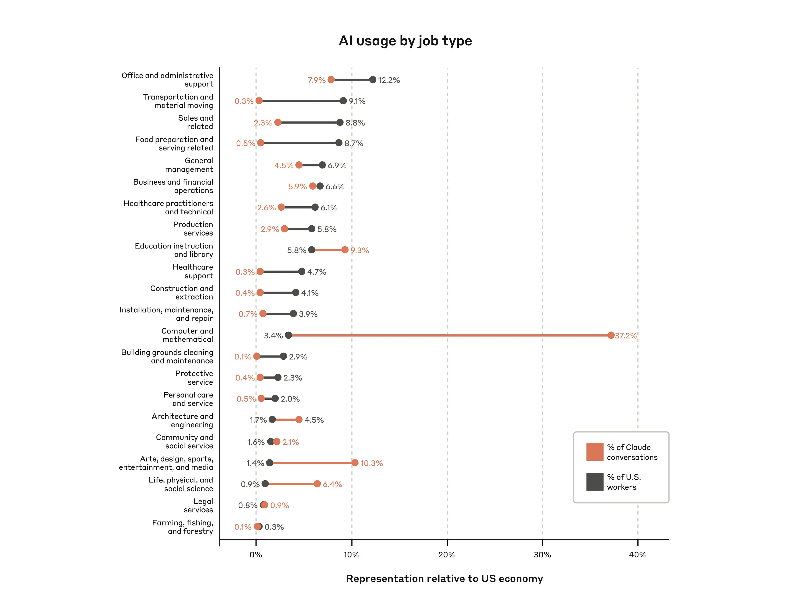
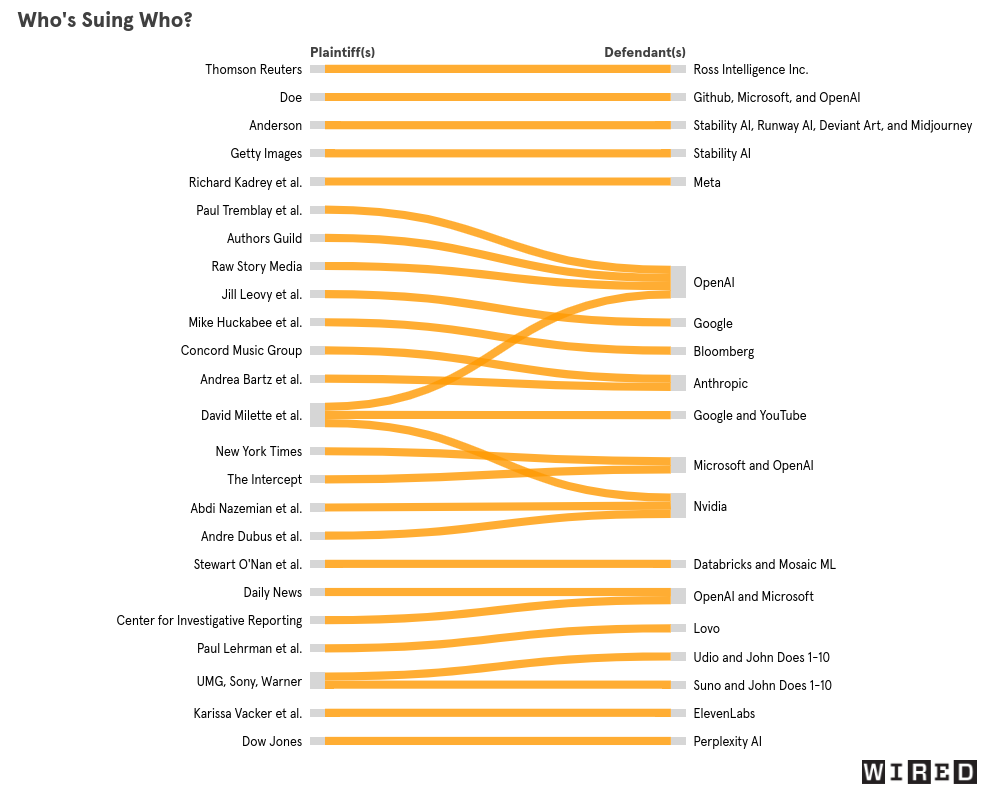

Cette page a vocation à évoluer au fil de mes lectures.
C'est avant tout une manière pour moi de garder une trace d'articles intéressants,
et j'espère que cela peut être utile à d'autres pour se faire un aperçu de ce sujet complexe.

## Qu'est-ce que l'IA?

[What is AI?](https://www.technologyreview.com/2024/07/10/1094475/what-is-artificial-intelligence-ai-definitive-guide/) (MIT Technology Review, Juillet 2024):
Un long article pour présenter les points de vue très différents que des expert·es ont sur ce qu'est l'IA.
Difficile d'en tirer une conclusion si ce n'est qu'il y a des désaccords fondamentaux et qu'ils reflètent davantage des différences d'idéologies que de maîtrise du sujet.

## Utilisation

19% des français utilisent chatgpt: [Un Français sur cinq a déjà utilisé ChatGPT - Odoxa](https://www.odoxa.fr/sondage/un-francais-sur-cinq-a-deja-utilise-chatgpt/).
En février 2025, OpenAI annonce avoir 400 millions d'utilisateurs par semaine (source: [Reuters](https://www.reuters.com/technology/artificial-intelligence/openais-weekly-active-users-surpass-400-million-2025-02-20/)).

OpenAI/chatGPT a probablement plus d'utilisateurs qui tous les autres LLMs combinés ([Edward Zitron](https://www.wheresyoured.at/wheres-the-money/), février 2025).

Les belges sont moins optimistes que la moyenne par rapport à l'IA:
41% des belges pensent que l'IA aura un impact positif sur leur vie, contre 61% en moyenne dans le monde.
([Global opinions and expectations about AI](https://www.ipsos.com/sites/default/files/ct/news/documents/2022-01/Global-opinions-and-expectations-about-AI-2022.pdf), enquête Ipsos, janvier 2022)

Il semble que mieux connaître le fonctionnement des IA ferait qu'on l'utilise moins
([The Conversation](https://theconversation.com/knowing-less-about-ai-makes-people-more-open-to-having-it-in-their-lives-new-research-247372), janvier 2025).
Un résultat surprenant, et je n'ai pas accès à l'article original pour en savoir plus.

Une étude de Microsoft research montre que les personnes qui utilisent plus d'IA générative
ont le sentiment de moins utiliser leur esprit critique et d'être moins capables d'évaluer la qualité du résultat de l'IA par eux-mêmes.
Source: [L'étude originale](https://www.microsoft.com/en-us/research/uploads/prod/2025/01/lee_2025_ai_critical_thinking_survey.pdf),
et [Un article de 404media](https://www.404media.co/microsoft-study-finds-ai-makes-human-cognition-atrophied-and-unprepared-3/).
L'étude se base uniquement sur des questionnaires où les participant.es évaluent leur propre utilisation de l'IA et leur esprit critique.

D'après [Anthropic](https://www.anthropic.com/news/the-anthropic-economic-index) (janvier 2025), 37% de l'utilisation professionnelle de leur LLM se fait dans le domaine de l'informatique, 10% dans le domaine des arts & media et 9% dans le domaine de l'éducation:

Un bémol par rapport à cette étude: Anthropic est peu connu du grand public, et leur LLM est réputé pour être le meilleur pour les tâches de programmation. Il est donc probable que cette étude ne reflète pas l'utilisation de ChatGPT, le LLM le plus populaire, et surreprésente l'usage pour la programmation.

## Copyrigth

[Meta pirate du contenu pour entrainer son IA](https://fingfx.thomsonreuters.com/gfx/legaldocs/lbvgjdkdopq/META%20COPYRIGHT%20LAWSUIT%20libgen.pdf) (Reuters, janvier 2025):
Grâce aux communications internes de Meta, obtenues dans le cadre d'un procès concernant les données d'entraînement de son IA,
il apparaît que Meta a utilisé la plus grande base de données de livres piratés (LibGen) pour entraîner son IA.

> Meta knowingly used a version of LibGen for which Mr. Bashlykov had written a script
> “to remove copyright information,” including “the word copyright, the word ‘acknowledgments,’
> and matches upon phrases and lines in... the book that did that”

Tout cela avec la validation de Mark Zuckerberg.

> memo to Meta’s AI decision-makers noting that after “escalation to MZ,” Meta’s AI team “has been approved to use LibGen”

[To Whom Does the World Belong?](https://www.bostonreview.net/articles/to-whom-does-the-world-belong/) (Boston Review, décembre 2024):
A qui appartient le contenu généré par une IA? Les développeurs, les entreprises, les utilisateurs, les IA elles-mêmes, tout le monde?
Peut-être que la notion de propriété intellectuelle n'est pas adaptée au contenu généré par une IA.

> we can’t afford to wait for all the money and power to accrue to Silicon Valley and then get together to have a big think about redistributing.
> We need to consider these rules now and work immediately toward a new intellectual property framework

Cette question a une grande importance, les IA génératives peuvent générer de la propriété intellectuelle plus rapidement que jamais, et d'après une étude de 2010,
"The value of intellectual property exceeds 65% for Fortune 500 companies and exceeds 90% for certain technology-based companies within the list"
(cité depuis [The Value of Intellectual Property](https://www.heerlaw.com/value-intellectual-property)).

[Every AI Copyright Lawsuit in the US](https://www.wired.com/story/ai-copyright-case-tracker/) (The Verge, décembre 2024)

Il existe un standard pour interdire l'accès à son site web aux IA, mais il semble peu respecté par les developpeurs de LLMs ([Tow Center for Digital Journalism](https://www.cjr.org/tow_center/we-compared-eight-ai-search-engines-theyre-all-bad-at-citing-news.php)).
Il est cependant difficile de prouver qu'un LLM est entrainé sur des sites qui en interdisent l'accès, car même si le LLM reproduit un contenu "interdit", ce contenu pourrait avoir été récupéré via des copies sur d'autres sites.

## Travail caché

Sur le travail d'annotation:

- [AI Is a Lot of Work](https://www.theverge.com/features/23764584/ai-artificial-intelligence-data-notation-labor-scale-surge-remotasks-openai-chatbots) (The Verge, juin 2023)
- [OpenAI Used Kenyan Workers on Less Than $2 Per Hour to Make ChatGPT Less Toxic](https://time.com/6247678/openai-chatgpt-kenya-workers/) (Time, janvier 2023)

[Becoming a chatbot](https://www.theguardian.com/technology/2022/dec/13/becoming-a-chatbot-my-life-as-a-real-estate-ais-human-backup)
(The Guardian, décembre 2022):
Derrière un chatbot pour une agence immobilière se cachaient 60 personnes qui relisaient les réponses du chatbot et prenaient le relais quand nécessaire.

## Impacts environnementaux

### Consommation électrique

[Powering Artificial Intelligence](https://www.deloitte.com/content/dam/assets-shared/docs/about/2024/powering-artificial-intelligence.pdf) (Deloitte, novembre 2024):
Deloitte estime que la consommation électrique liée à l'IA a augmenté de 47% par an entre 2020 et 2023, et devrait continuer à augmenter de 28% à 44% par an pendant les années à venir.

[Data center emissions probably 662% higher than big tech claims](https://www.theguardian.com/technology/2024/sep/15/data-center-gas-emissions-tech) (The Guardian, septembre 2024):
Les déclarations des GAFAM sur leur empreinte carbone sont trompeuses car elles se basent sur l'achat massif de certificats verts pour compenser leur émissions réelles.
Les émissions réelles de leurs data centers sont beaucoup plus élevées: probablement 3x plus pour Google, 21x plus pour Microsoft et 3000x plus pour Meta.
On parle ici de toutes les activités des data centers, pas seulement celles liées à l'IA.

[AI needs so much power, it's making yours worse](https://www.bloomberg.com/graphics/2024-ai-power-home-appliances/) (Bloomberg, décembre 2024):
Les data centers semblent créer des distorsions sur le réseau électrique environnant (en ajoutant des harmoniques sur le courant alternatif), ce qui peut endommager les appareils électriques des habitants.

Ce ne sont pas les impacts environnementaux qui vont freiner les géants de l'IA.
L'ancien CEO de google le dit clairement:
"We're not going to hit the climate goals anyway because we're not organized to do it [...] I'd rather bet on AI solving the problem, than constraining it and having the problem."
(Eric Schmidt, cité depuis [Mashable](https://mashable.com/article/former-google-ceo-invest-ai-despite-climate-concerns), octobre 2024)

[EcoLogits](https://huggingface.co/spaces/genai-impact/ecologits-calculator) propose d'estimer la consommation énergétique d'une requête à un LLM.

### Consommation d'eau

Le sujet de la consommation d'eau est complexe.
Les data centers utilisent en effet beaucoup d'eau pour refroidir les serveurs, mais l'impact de cette consommation va dépendre de la région, de la source de l'eau, de ce qu'elle devient après utilisation (relachée à plus haute température, évaporée ?), etc.

Cela dit, dans certains cas les data centers semblent avoir un impact direct sur l'accès à l'eau dans la région.
Par exemple à Colón, au Mexique, une zone semi-aride où Microsoft, Google et Amazon construisent des data centers grâce aux aides de la région.
Microsoft a obtenu le droit d'utiliser l'équivalent de 24% de la consommation d'eau de la commune, alors que les fermiers de la région ont perdu leurs récoltes à cause de sécheresses successives.
([Thirsty data centres spring up in water-poor Mexican town](https://www.context.news/ai/thirsty-data-centres-spring-up-in-water-poor-mexican-town), Context, septembre 2024)

## Hallucinations

Les LLMs produisent du texte mot par mot, en associant à chaque mot une probabilité d'apparaitre après les mots précédents.
Cette approche produit des textes vraisemblables, mais qui ne sont pas toujours factuellement corrects.
On parle alors d'hallucinations.
D'après certain•es chercheur•ses, ces hallucinations sont inévitables ([LLMs Will Always Hallucinate, and We Need to Live
With This](https://arxiv.org/pdf/2409.05746), septembre 2024).

Voici quelques exemples d'hallucinations et des problèmes qu'elles posent:

[AI-powered transcription tool used in hospitals invents things no one ever said](https://apnews.com/article/ai-artificial-intelligence-health-business-90020cdf5fa16c79ca2e5b6c4c9bbb14) (AP, octobre 2024):
Des hôpitaux aux US utilisent un outil de transcription automatique pour garder une trace écrite des consultations.
Cet outil, basé sur le modèle Whispers d'OpenAI, invente parfois des phrases entières.
De plus, l'audio original est supprimé pour des raisons de confidentialité, ce qui rend impossible de vérifier la véracité des transcriptions.

[AI Search Has A Citation Problem](https://www.cjr.org/tow_center/we-compared-eight-ai-search-engines-theyre-all-bad-at-citing-news.php) (Columbia Journalism Review, mars 2025):
Une équipe de l'université de Columbia a testé 8 LLMs dotés de capacités de recherche.
Les LLMs recevaient un extrait d'un article de presse et devaient trouver la source de cet extrait (titre, publication, url).
Les réponses étaient fausses dans plus de 60% des cas. Les versions payantes avaient de pires résultats que les versions gratuites.
Les LLMs inventent de faux liens ou des liens vers les mauvais articles.
Ce problème persiste même dans les cas où il existe un accord de licence entre le média et l'entreprise fournissant le LLM.

Dans la même veine, la BBC a évalué plusieurs LLMs à travers 362 questions sur l'actualité en demandant d'utiliser la BBC comme source de préférence.
19% des réponses contenaient des erreurs factuelles, et 13% des citations étaient soit transformées soit purement inventées ([source: BBC](https://www.bbc.co.uk/aboutthebbc/documents/bbc-research-into-ai-assistants.pdf), janvier 2025).

Le chatbot d'Amazon veut rediriger les utilisateurs qui expriment des pensées suicidaires vers une ligne de prévention du suicide, mais hallucine de faux numéros de téléphone ([Futurism, février 2025](https://futurism.com/amazon-ai-suicide-hotline)).

## Capacités

[Things we learned about LLMs in 2024](https://simonwillison.net/2024/Dec/31/llms-in-2024/):
Un bon aperçu de l'évolution des LLMs en 2024 par Simon Willison.

De manière générale, le [blog de Simon Willison](https://simonwillison.net/tags/ai/) est une bonne source d'information sur les performances des LLMs.

[DeepSeek FAQ](https://stratechery.com/2025/deepseek-faq/) (Stratechery, janvier 2025):
DeepSeek est une famille de LLMs développés par une entreprise chinoise.
Ce sont les premiers modèles "open-source" dont les performances égalent celles des modèles les plus performants de OpenAI et Anthropic
(à l'exception probablement du modèle o3 d'OpenAI, qui n'est pour l'instant accessible qu'à une poignée de chercheurs·euses).
Les interdictions d'export imposées par les US font que DeepSeek a été développé sur des GPUs d'ancienne génération.
Cela a forcé les développeurs à de nombreuses innovations sur l'architecture des modèles et à un important travail d'optimisation ("an insane level of optimization" d'après Ben Thompson).
Le résultat est un modèle non seulement très puissant, mais aussi beaucoup moins énergivore que les modèles concurrents, tant à l'entraînement qu'à l'inférence.

D'après Ben Thompson, DeepSeek a probablement utilisé abondamment les données générées par les modèles de OpenAI et Anthropic, comme source d'entraînement.

[Thoughts On A Month With Devin](https://www.answer.ai/posts/2025-01-08-devin.htm) (Answer.AI, janvier 2025):
Devon est l'un des premiers "agents" IA, un programme censé pouvoir réaliser des tâches complexes de A à Z au point de pouvoir vous remplacer au travail.
La spécialité de Devon est la programmation, mais d'après les tests de l'équipe d'answer.ai les résultats ne sont pas fameux:
le programme n'a su compléter que 3 des 20 tâches demandées.

> Even more telling was that we couldn’t discern any pattern to predict which tasks would work.
> Tasks that seemed similar to our early successes would fail in unexpected ways.

## Surveillance

[L’Oracle de l’Empire](https://legrandcontinent.eu/fr/2025/01/24/dominer-la-societe-avec-lia-la-face-cachee-du-projet-stargate-x/) (Le Grand Continent, janvier 2025):
Dans un discours à propos du projet Stargate (100 milliard d'investissement dans les data centers IA aux US), Larry Ellison (fondateur d'Oracle, un des hommes les plus riches du monde) annonce vouloir filmer tout le monde en permanence et tout analyser via de l'IA:

> Nos caméras, ce sont simplement deux objectifs fixés à votre veste et liés à votre smartphone, le tout directement sur votre corps.
> La caméra est toujours allumée.
> Vous ne pouvez pas l’éteindre.

> Les citoyens aussi se comporteront mieux car nous enregistrons et rapportons tout ce qui se passe. Et c’est inévitable. Les voitures ont aussi des caméras.

> Sans travail humain, pas de malveillance humaine, pas d’erreur humaine — et pas de coût humain.

En Belgique, le nouveau gouvernement prévoit d'utiliser la reconaissance faciale et d'étendre les possibilités d'utilisation des caméras de surveillance ([Accord de coalition fédérale 2025-2029](https://www.belgium.be/sites/default/files/resources/publication/files/Accord_gouvernemental-Bart_De_Wever_fr.pdf), p145).
C'est apparement la France apparement qui a poussé pour que ce genre de surveillance par IA soit autorisé en Europe ([Investigate Europe](https://www.investigate-europe.eu/fr/posts/france-spearheads-member-state-campaign-dilute-european-artificial-intelligence-regulation), janvier 2025).

La commune de Vernon en France offre un exemple de discours sur les caméras de surveillance couplées à de l'IA. Le maire y tient ces propos: "ça va nous aider face aux problèmes d’incivilités. Demain, une caméra pourrait détecter un mégot de cigarette jeté par terre. J’ai demandé à des prestataires de faire des propositions pour trouver le bon algorithme." ([source: Le Parisien, janvier 2025](https://www.leparisien.fr/eure-27/vernon-mise-sur-lintelligence-artificielle-pour-lutter-contre-les-incivilites-et-gagner-en-productivite-27-01-2025-YO6CHGD6XBGMDOIIOVBULFOSDQ.php))

A travers son API "Cloud Vision AI", Google propose de déterminer l'âge, l'orientation politique ou encore les centres d'intérêt d'une personne sur base d'une photo.
On ne sait pas quelle est la précision de cet outil, mais on peut le tester soit-même sur [https://theyseeyourphotos.com/](https://theyseeyourphotos.com/).

En février 2025, Google change ses principes de gouvernance pour s'autoriser à développer de l'IA dans le domaine de l'armement et de la surveillance ([Le monde](https://www.lemonde.fr/pixels/article/2025/02/05/google-assouplit-ses-principes-concernant-l-usage-de-l-ia-dans-l-armement-ou-la-surveillance_6532915_4408996.html)).

## Sécurité & Alignement
Quand les développeurs d'IA parlent des risques liés à l'IA, iels parlent souvent de ce qu'on appelle le problème "d'alignement".
C'est à dire, comment s'assurer que l'IA fasse effectivement ce que l'on veut qu'elle fasse, et pas autre chose.
Plus on donnera de capacité aux IA d'effectuer des actions et de prendre des décisions ayant un impact réel, plus ce risque sera important.
Malheureusement, il semble que plus les IA deviennent performantes, plus il est compliqué de comprendre comment elles fonctionnent et donc de s'assurer qu'elles sont alignées.

[AI Safety for Fleshy Humans](https://aisafety.dance) (Nicky Case & Hack Club):
Long article (encore en cours d'écriture) sur les risques liés à l'alignement de l'IA.

[o1 et Claude sont-ils capablent de nous manipuler](https://www.youtube.com/watch?v=cw9wcNKDOtQ) (Monsieur Phi, décembre 2024):
Vidéo vulgarisant les résultats des deux articles suivants:

- [Frontier Models are Capable of In-context Scheming](https://static1.squarespace.com/static/6593e7097565990e65c886fd/t/67869dea6418796241490cf0/1736875562390/in_context_scheming_paper_v2.pdf) ([synthèse](https://www.apolloresearch.ai/research/scheming-reasoning-evaluations))
- [Alignment faking in large language models](https://arxiv.org/pdf/2412.14093) ([synthèse](https://www.anthropic.com/research/alignment-faking))

Ces articles observent que Les LLMs actuels montrent des comportement problématiques quand mis face à des objectifs contradictoires. Par exemple:

- Sandbagging: l'IA bride ses capacités quand on indique que des capacitées plus élevées mèneront à un réentrainement
- Alignment faking: l'IA répond de manière différente dans un environnement de test que dans un environnement de production

### Critique du problème d'alignement
De nombreuses personnes critiques de l'IA considèrent que le problème d'alignement est une diversion
qui nous empêche de parler des problèmes actuels liés aux IA, et qui véhicule l'idée que les IA "superintelligentes" sont imminentes, ce qui est très controversé.

## Marché

Les LLMs sont jusqu'à présent très loin d'être profitables.
OpenAI a dépensé près de 9 milliards en 2024 et n'a généré que 3,7 milliards en revenus ([OpenAI Is Growing Fast and Burning Through Piles of Money](https://www.nytimes.com/2024/09/27/technology/openai-chatgpt-investors-funding.html), NYT, septembre 2024).
Anthropic aurait de son côté [5,6 milliards de pertes](https://www.reuters.com/technology/anthropic-projects-soaring-growth-345-billion-2027-revenue-information-reports-2025-02-13/) et [moins d'un milliards de revenus](https://www.reuters.com/technology/anthropic-forecasts-more-than-850-mln-annualized-revenue-rate-by-2024-end-report-2023-12-26/) pour 2024 (source: Reuters).

## ADMS

Cette liste de lecture se concentre surtout sur l'IA générative et en particulier les LLMs,
mais il me semble important de parler aussi des systèmes de décision automatisée (ADMS, pour Automated Decision Making Systems).

Quand on parle d'ADMS, on ne s'intéresse pas vraiment à comment fonctionne le système (quel algorithme),
mais plutôt à ses conséquences.
Par exemple, un algorithme qui identifie des déclarations fiscales à contrôler en priorité est un ADMS, qu'il soit basé sur des règles simples ou un modèle de deep learning.

Les ADMS sont de plus en plus couramment utilisés, et leur conséquences peuvent être très importantes,
en particulier quand elles sont déployées dans des services publics.
Ces dernières années ont déjà montré plusieurs échecs de ces systèmes, qui ont souvent mené à des pertes de droits pour des personnes déjà précaires.
Pourtant, ces systèmes continuent à être déployés.

Quelques exemples:

- Entre 2014 et 2020, des milliers de familles néérlandaises ont été accusées de fraude par un système automatisé et ont perdu leurs allocations familiales.
  Cela a fait [tomber le gouvernement en 2021](https://www.rtbf.be/article/crise-politique-aux-pays-bas-demission-du-premier-ministre-mark-rutte-10674533).
  4 ans plus tard, la [plupart des familles n'ont pas encore été dédommagées](https://www.lemonde.fr/international/article/2025/01/09/aux-pays-bas-le-cout-d-un-scandale-sur-les-allocations-familiales-qui-engorge-les-tribunaux_6489882_3210.html).
- [Machine Bias](https://www.propublica.org/article/machine-bias-risk-assessments-in-criminal-sentencing) (Propublica, mai 2016):
  Un outil utilisé par des tribunaux pour estimer un risque de récidive a un fonctionnement secret et semble biaisé contre les personnes noires.
- [l’assurance-maladie coupe dans les indemnités de milliers d’usagers](https://www.mediapart.fr/journal/france/270125/prise-au-piege-de-son-logiciel-l-assurance-maladie-coupe-dans-les-indemnites-de-milliers-d-usagers) (Mediapart, janvier 2025):
En France, un nouveau système automatique de paiement des indemnités de l'assurance-maladie testé dans quelques départements dysfonctionne et des milliers de personnes se retrouvent sans indemnités depuis plusieurs mois.
